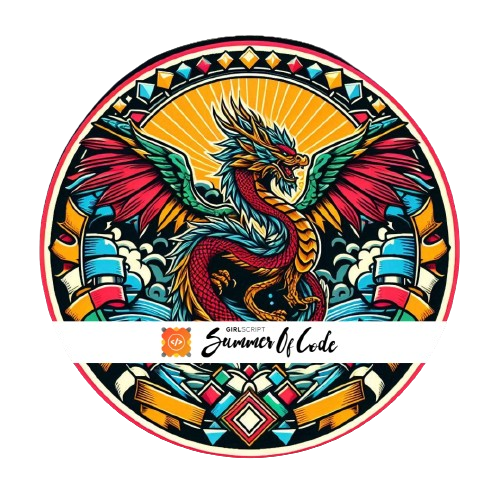
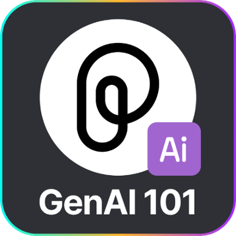

 <!--### Hi there! 👋

# Developer Profile - Brajesh Kumar -->
### <h1 align="center">Hello Folks 👋, I'm Brajesh Kumar</h1> 

  

     
     
    
    

## 👨🏻‍💻 About Me:

- 🙋‍♂️ **All about me is at [My Website](https://edtech-community.com)** – Explore my projects, blogs, and everything I do.
- 🔭 Currently, I’m working on **Agrilearn AI**, an AI-powered agricultural information platform, and **Tech Dev Club**, a community for tech enthusiasts.
- 🌱 I’m learning **MERN Stack**, **AI/ML**, **Blockchain** to stay on the cutting edge of technology.
- 👯 I’m open to collaborating on **Dev Projects**, **AI Solutions**, and **Blockchain Integrations**.
- 🤔 Looking for guidance and mentorship in **Competitive Programming** and **Advanced AI Models**.
- 💬 Feel free to ask me about anything—except **Maths** (I’m not great with that 😅).
- ⚡ **Fun Fact**: I’m a **gaming enthusiast** and love playing games in my free time 🎮.
- Passionate learner and detail-oriented developer with a strong background in web development and backend programming.
- Proficient in:
  - React, HTML, CSS, and JSX for building dynamic and responsive user interfaces.
  - Python, FastAPI, Selenium, and BeautifulSoup for backend development, automation, and web scraping.
- Contributed significantly to a comprehensive web application project, demonstrating expertise in both frontend and backend technologies.

### :zap: GitHub Stats 📈
<!---->

<!---->

 

  

<!--     -->

  <table>
    <tr>
      <td style="padding-right: 4px;">
        
      </td>
      <td style="padding-left: 4px;">
        
      </td>
    </tr>
  </table>

  

  <table style="border: none; padding: 0; margin: 0;">
    <tr>
      <td style="padding: 10px; vertical-align: top;">
        
      </td>
      <td style="padding: 10px; vertical-align: top;">
        
      </td>
    </tr>
  </table>

  <table style="border: none; padding: 0; margin: 0;">
    <tr>
      <td style="padding: 10px; vertical-align: top;">
        
      </td>
      <td style="padding: 10px; vertical-align: top;">
        
      </td>
    </tr>
  </table>

  

 

<!-- Contribution Chart Below the Table -->

  

🪶 Badges 

<!-- Row 1 -->
<table align="center">
  <tr align="center">
    <td style="border-right: 1px solid #eeeeef;" align="center">
      
       <strong>Adventurer</strong>
    </td>
    <td style="border-right: 1px solid #eeeeef;" align="center">
      
       <strong>Champion</strong>
    </td>
    <td style="border-right: 1px solid #eeeeef;" align="center">
      
       <strong>Conqurer</strong>
    </td>
    <td style="border-right: 1px solid #eeeeef;" align="center">
      
       <strong>Explorer</strong>
    </td>
    <td align="center">
      
       <strong>Innovator</strong>
    </td>
  </tr>
</table>

<!-- Row 2 --> 
<table align="center">
  <tr align="center">
    <td style="border-right: 1px solid #eeeeef;" align="center">
      
       <strong>Postman</strong>
    </td>
    <td style="border-right: 1px solid #eeeeef;" align="center">
      
       <strong>Summit Seeker</strong>
    </td>
    <td style="border-right: 1px solid #eeeeef;" align="center">
      
       <strong>Trailblazer</strong>
    </td>
    <td style="border-right: 1px solid #eeeeef;" align="center">
      
       <strong>Hands-on Collab</strong>
    </td>
    <td align="center">
      
       <strong>GitHub Copilot</strong>
    </td>
  </tr>
</table>

<!-- Row 3 -->
<table align="center">
  <tr align="center">
    <td style="border-right: 1px solid #eeeeef;" align="center">
      
       <strong>Hands-on Snowflake</strong>
    </td>
    <td style="border-right: 1px solid #eeeeef;" align="center">
      
       <strong>Dragon</strong>
    </td>
    <td style="border-right: 1px solid #eeeeef;" align="center">
      
       <strong>Assertion</strong>
    </td>
    <td style="border-right: 1px solid #eeeeef;" align="center">
      
       <strong>Git Explorer</strong>
    </td>
    <td align="center">
      
       <strong>Hack-Web3Conf 2024</strong>
    </td>
  </tr>
</table>

## 🎯 Expertise Areas

💻 Development Environment

    
    
    
    

<table>
  <tr>
    <td>💻 <strong>Frontend Development</strong></td>
    <td>
      
      
      
      
      
      
      
    </td>
  </tr>

  <tr>
    <td>🌐 <strong>Web Development</strong></td>
    <td>
      
      
      
    </td>
  </tr>

  <tr>
    <td>💻 <strong>Backend Development</strong></td>
    <td>
      
      
      
      
      
      
      
    </td>
  </tr>

  <tr>
    <td>📋 <strong>Programming Languages</strong></td>
    <td>
      
      
      
      
      
      
      
      
    </td>
  </tr>

  <tr>
    <td>📂 <strong>Database</strong></td>
    <td>
      
      
      
    </td>
  </tr>

  <tr>
    <td>⚙️ <strong>DevOps Tools</strong></td>
    <td>
      
      
      
      
    </td>
  </tr>

  <tr>
    <td>🛠️ <strong>Developer Tools</strong></td>
    <td>
      
      
      
    </td>
  </tr>

  <tr>
    <td>📘 <strong>SDLC</strong></td>
    <td>
      
      
      
      
    </td>
  </tr>
</table>

  
🔨 Tech Stack

  

    <h3>Languages:</h3>
    
    
    
    
    
    
    <h3>Frontend Development:</h3>
    
    
    
    
    <h3>Backend & Database:</h3>
    
    
    
    <h3>DevOps & Cloud:</h3>
    
    
    
    
    <h3>AI/ML & Data Science:</h3>
    
    <h3>IoT & Electronics:</h3>
    
    
    
  

  
<strong>Frontend Development</strong> (Click to expand)

   
  

    
    
    
    
    
    
    
    
    
    
  

  
<strong>Backend Development</strong> (Click to expand)

   
  

    
    
    
    
  

  
<strong>Database & Management</strong> (Click to expand)

   
  

    
    
    
  

  
<strong>Version Control & Other Tools</strong> (Click to expand)

   
  

    
    
    
  

  
<strong>DevOps & Cloud</strong> (Click to expand)

   
  

    
    
    
    
    
  

  
<strong>AI/ML & Data Science</strong> (Click to expand)

   
  

    
    
    
  

  
<strong>IoT & Electronics</strong> (Click to expand)

   
  

    
    
  

## 💭 Developer Quote

    

## ❤️ Let's get connected:

    
    
    
    

## Projects Highlights

- **Frontend Development:**
  - Utilized React to create dynamic and interactive user interfaces.
  - Implemented responsive design principles for a seamless user experience.
  - Collaborated with the design team to ensure a visually appealing and intuitive frontend.

- **Backend Development:**
  - Implemented backend functionalities using Python and FastAPI.
  - Integrated frontend and backend components to ensure smooth communication.
  - Contributed to the design and implementation of RESTful APIs.

- **Automation and Web Scraping:**
  - Developed automation scripts using Selenium for efficient and reliable processes.
  - Utilized BeautifulSoup for web scraping tasks, extracting relevant data for analysis.

    

Feel free to reach out if you have any questions or if there's an opportunity for collaboration! 😊
 

<h2>Starring repos will be appreciated as your ❤️ for me. 😃 </h2>

<!--   
 <h4 align="center">Wait!👋 don't forget to check out my social media handles </h4>

  <code></code>
  <code></code>  
  <code></code>

 
 
# 📊GitHub Stats :
 
 

## 🏆GitHub Trophies

---

-->

    

### 💡 Contribution & Open Source:
I contribute regularly to open-source projects and love collaborating with others on GitHub. Let's build something impactful!

  <picture>
    <source media="(prefers-color-scheme: dark)" srcset="https://raw.githubusercontent.com/platane/snk/output/github-contribution-grid-snake-dark.svg">
    <source media="(prefers-color-scheme: light)" srcset="https://raw.githubusercontent.com/platane/snk/output/github-contribution-grid-snake.svg">
    
  </picture>

    © 2021 Brajesh Kumar

    

